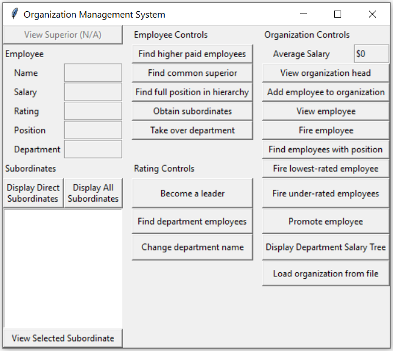

# Organization_Managaer (University Project)

The project manages employees, leaders and the head of an organization in an hierarchical manner.

File descriptions:
- organization_hierarchy.py : The complete back-end of the program
- organization_ui.py : The UI interface that uses a Python library called **Tkinter**
- client_code.py : The controller connecting organization_hierarchy.py and organization_ui.py
- test_organization_hierarchy.py : The test file for the project. (Most of the testing has been done in doctests)
- employees.txt : File to load a sample organisation.

Running the **organization_ui.py** runs the project.

Here is an exmaple of how the UI looks

